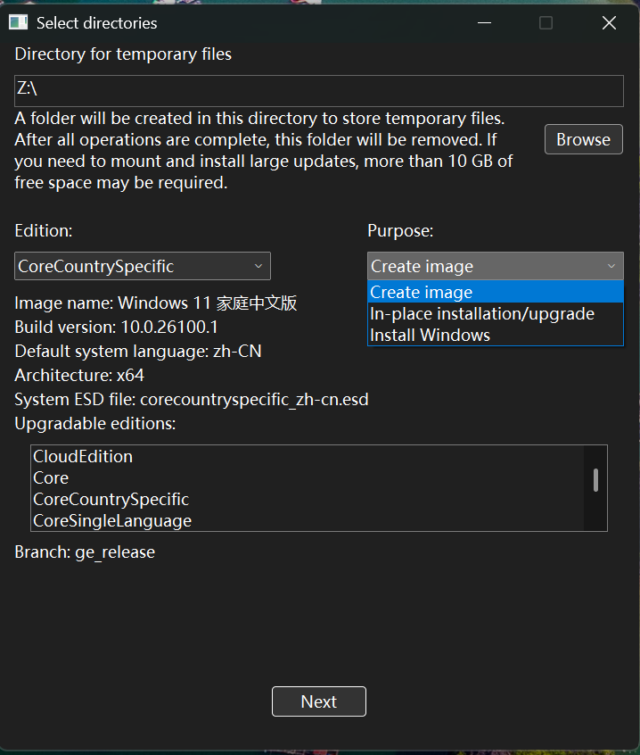
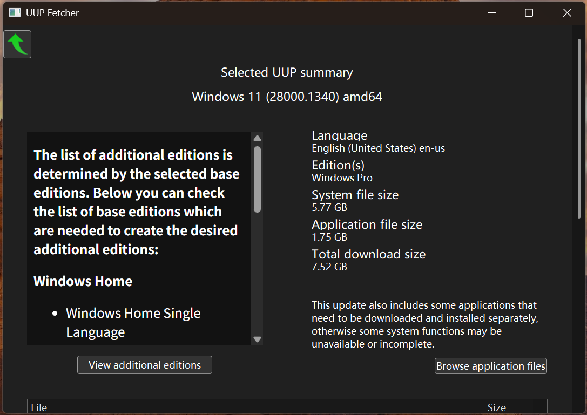
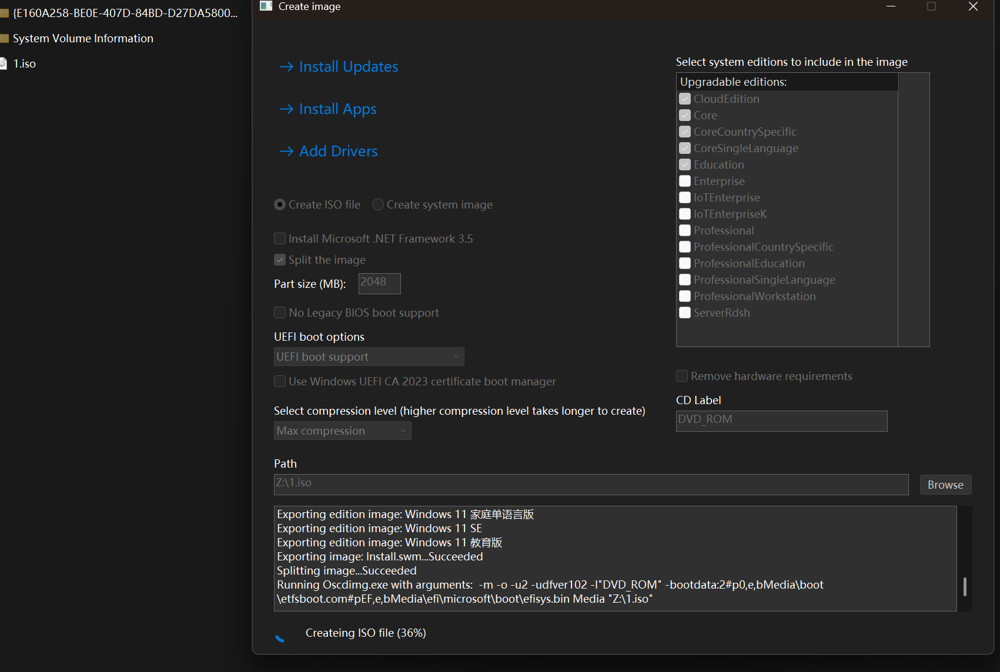
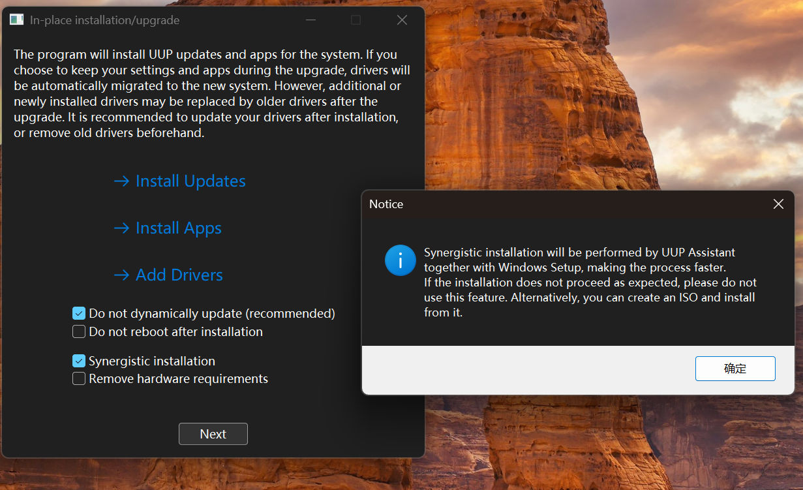
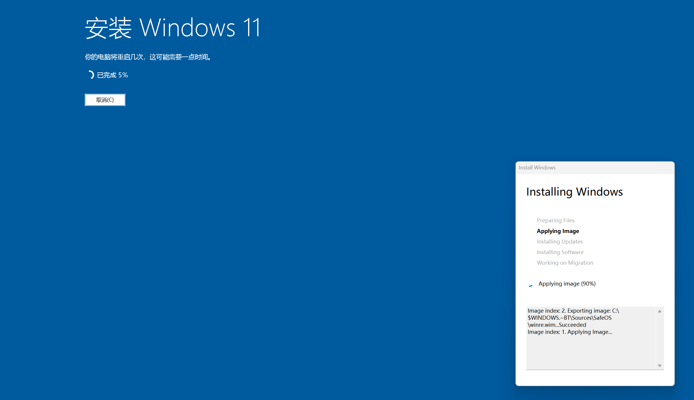
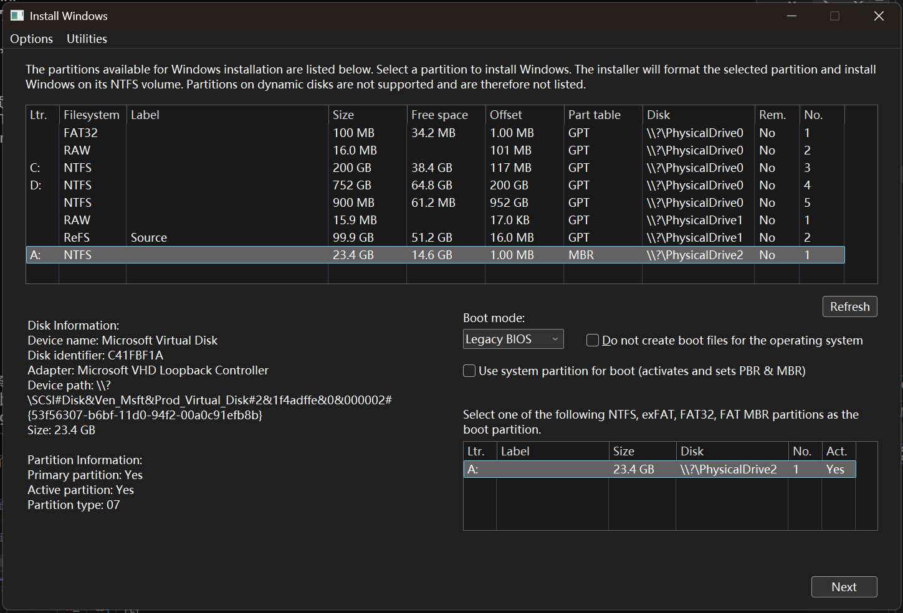
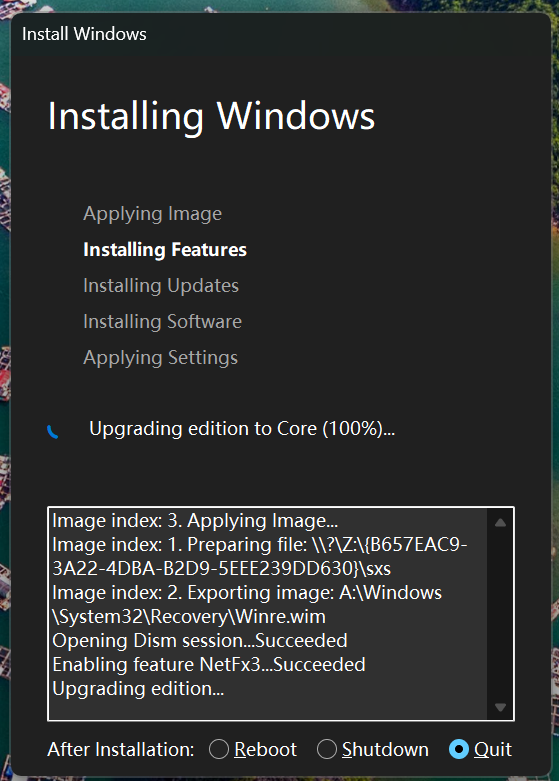
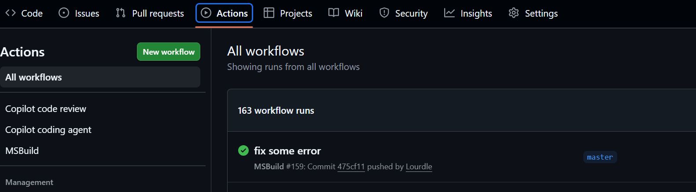
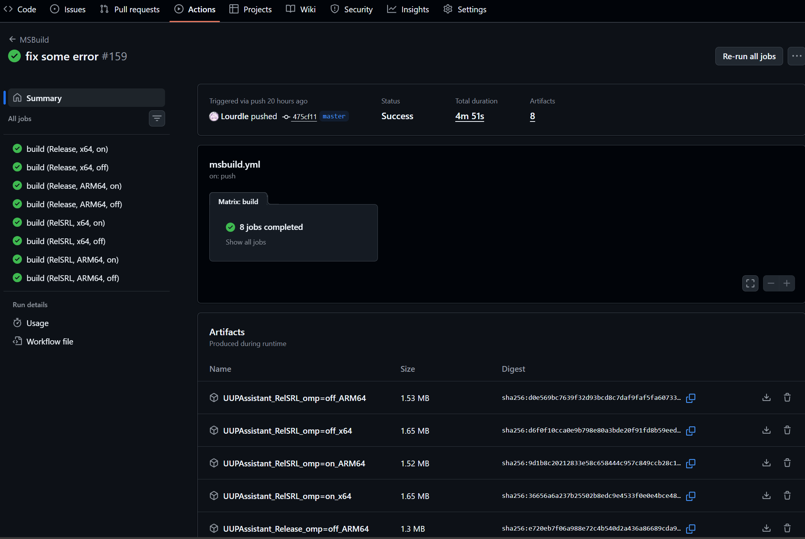

# UUP Assistant
English | [简体中文](README_zh-CN.md)

## Overview
UUP Assistant is an open-source project designed to simplify downloading, merging, and using UUP (Unified Update Platform) files from Microsoft servers. It supports various Windows versions, including Windows 10 and Windows 11.  
The tool allows users to select the desired Windows version, architecture, and language, then automatically downloads the necessary UUP files and generates a bootable ISO image, performs a direct installation, or performs an in-place upgrade. It can also run most operations (except the in-place upgrade) under Windows PE or Windows RE.  
I have been writing this project intermittently for nearly five years, undergoing multiple major updates and refactorings. Since much of the code was written years ago when I was a novice, there is a lot of legacy code ("spaghetti code"), and few comments, so even I find it a bit messy to look at.

<div style="display:flex; gap:10px;">
  
  
</div>

This project is not affiliated with the UUP Dump website or Microsoft Corporation. The downloaded files are for evaluation, study, and research purposes only. The software itself does not include system activation functionality; please ensure you have a valid license to use Windows.

## Features
- Supports downloading UUP files and system Appx application packages, and verifying their integrity.
- Supports generating bootable ISO images and WIM files.
- Supports direct installation of Windows. Can customize OOBE, user accounts, virtual memory, pre-assign volume letters, partition tables, ReFS volume boot, VHD boot, etc.
- Supports in-place upgrade of Windows, with options to keep user data and applications, keep personal files only, or perform a clean install.
- Supports switching between multiple architectures and Windows versions.
- Supports installing updates.
- Supports installing Appx application packages.
- Supports installing driver packages.
- Supports bypassing Windows 11 hardware requirement checks.

<div style="display:flex; gap:10px;">
  
</div>
<div style="display:flex; gap:10px;">
  
  
</div>
<div style="display:flex; gap:10px;">
  
  
</div>

## Build
### Clone Repository and Submodules
```bash
git clone --recurse-submodules https://github.com/Lourdle/UUPAssistant.git
```
### Build Solution
First, ensure that build tools such as MSVC are installed. Make sure the Windows SDK and the Windows ADK (Deployment Tools) are installed. To install Windows ADK, please visit the [Microsoft Official Website](https://learn.microsoft.com/windows-hardware/get-started/adk-install).  
Then restore NuGet packages. This can be done more conveniently if using Visual Studio.  
Currently, the configured platform toolset is `v143` (Visual Studio 2022). If using other versions of the toolset, please modify the platform toolset settings in the solution file yourself. However, you must ensure the build tools support the C++20 standard.  
The first build will check Git submodules and scan the ADK installation path. If the ADK Deployment Tools are not found, you cannot proceed. If the installation path is not in the default location (`C:\Program Files (x86)\Windows Kits\10\Assessment and Deployment Kit\Deployment Tools`), you can create a `deps\adk_path.txt` file to specify the path to the Deployment Tools.  
The first build of the solution may take a long time as some dependencies and build/configuration tools will be generated.  
Only x64 (amd64) and ARM64 platforms are supported; please ensure the corresponding build tools are installed.

### Optional Features
Currently, there is only one optional feature: using OpenMP to schedule parallel processing of CPU-intensive tasks. Enabling this feature allows using OpenMP environment variables to control certain settings, otherwise the program will manage multi-threaded parallel tasks itself.

#### Introduction to Configuration Tools
The program contains some build-time configuration tools located in the `tools` directory, where the `configure` tool is used to generate configuration files.  
When the solution is built for the first time, the `configure.exe` tool will be automatically generated in the `bin\tools` directory. When building the project, this tool will run automatically to generate the configuration file `configuration\global_features.h`.  
`global_features.h` file contains some macro definitions used to enable or disable specific features. Do not manually edit this file to change the configuration.

#### Custom Build Configuration
The feature configuration file is located at `configuration\features.json`. Opening the file, you will see content similar to the following:
```json
{
    "UseCRLF": true,
    "Features": [
        {
            "Id": "OMP",
            "Name": "OpenMP Parallel",
            "Description": "Use OpenMP for parallel",
            "Macro": "_USE_OMP",
            "Default": false
        }
    ]
}
```
The `UseCRLF` option specifies the line ending type used in the generated global configuration header file.  
The `Features` array contains a list of available features. Each feature has the following properties:
- `Id`: Unique identifier for the feature.
- `Name`: Name of the feature.
- `Description`: Description of the feature.
- `Macro`: Macro name to enable the feature. If enabled, this macro is defined in the generated configuration header file.
- `Default`: Boolean value specifying the default enabled status of the feature.

To manage enabling or disabling features, you can edit the `configuration\features.enable` file. The content is a list of enabled feature IDs and statuses, one per line. For example:
```
# UUPAssistant features
OMP=y
AnotherFeature=n
```
Lines starting with `#` are comments. `y`, `yes`, `true`, `1`, or `on` indicate enabling the feature; `n`, `no`, `false`, `0`, or `off` indicate disabling the feature. If a feature ID is not in this file, the default value in `features.json` is used.

### Releases
There are three builds: Debug, RelSRL, and Release.
- Debug: Contains debug information, suitable for debugging and development.
- RelSRL: Fully static runtime linked version, suitable for release and distribution. It can run on older versions.
- Release: Standard release version, suitable for release and distribution. Uses the system built-in VCRT dynamic link library, requiring newer Windows 10 versions for support. Smallest size.

## Download Prebuilt Releases
To download any prebuilt release, you can use the GitHub Actions workflow page.

On the workflow page, make sure the branch is the one you want (usually `main`), then open the latest workflow run.

<div style="display:flex; gap:10px;">
  
</div>

In the run's `Summary` page, you can find the generated release packages under `Artifacts` on the right side. Click the corresponding artifact to download the ZIP package.

## Usage
After the build completes, the generated executable files are located in the `<Platform>\<Configuration>\` directory, for example `x64\Release\`.  
Run `UUPAssistant.exe` to start the program.  
You can run `UUPFetcher.exe` directly to download UUP files and other resources. You can also start `UUPFetcher.exe` from `UUPAssistant.exe`, and upon completion of download verification, you can return directly to UUP Assistant to continue processing.  
When running the `Release` version, ensure the target system meets the runtime requirements. Otherwise, it is recommended to use the `RelSRL` version. If you encounter a missing `__CxxFrameHandler4` error at runtime, use the `RelSRL` version.  
The `RelSRL` version does not require installing any runtime components. Theoretically, this version of `UUPAssistant.exe` can run on Windows 8.1; `UUPFetcher.exe` can run on Windows Vista. I have not tested on these early versions, so full compatibility is not guaranteed.

### Common Issues Running on Early Windows Versions
`UUPAssistant.exe` (RelSRL) can run on Windows 8.1 or higher. However, even on slightly older versions of Windows 10, you may see errors due to missing functions in DismApi.dll.  
To resolve this, you need to copy newer DISM-related components to the application's working directory. There are two ways to obtain them:

#### Obtain from Windows ADK Deployment Tools
Located in `<ADK Install Path>\Deployment Tools\<Platform>\DISM`. Copy all files to the application's working directory.  
It seems newer versions of Windows ADK Deployment Tools no longer include DISM DLL components, only PowerShell modules. You can obtain these files from older ADK versions, such as the Windows 11 21H2 ADK.

#### Obtain from Newer Windows Installation Media
You can first use `UUPFetcher.exe` to download a newer Windows UUP build for the same architecture, then find the install image file (e.g., `professional_zh-cn.esd`, `core_en-us.esd`). Open that file with an archive tool (like 7-Zip), and extract the `1\sources` directory. Copy the files under the `sources` directory to the application's working directory.  
If you don't have an extraction tool, you can use the `Dism /Apply-Image` command to apply index `1` to a directory, then copy the files under the `sources` directory from that directory to the application's working directory. For example:
```cmd
Dism /Apply-Image /ImageFile:"path\to\your\esdfile.esd" /Index:1 /ApplyDir:"path\to\your\directory"
```

## Contribution
Any form of contribution is welcome! If you find bugs or have suggestions for improvement, please submit an issue. If you want to add new features or fix bugs, please submit a pull request.

## License
This project is licensed under the MIT License, see the [LICENSE file](LICENSE) for details.

## Third-party Libraries
This project uses the NuGet package manager to manage some third-party libraries, and some libraries are directly included in the source code.

The following is a list of third-party NuGet packages used:
- nlohmann/json: Used for JSON parsing. - [MIT License](https://github.com/nlohmann/json/blob/develop/LICENSE.MIT).
- rapidxml: Used for XML parsing. - [MIT License](https://rapidxml.sourceforge.net/license.txt).
- Windows Implementation Libraries (WIL): Used for managing some interfaces. - [MIT License](https://www.nuget.org/packages/Microsoft.Windows.ImplementationLibrary/1.0.250325.1/license).
- Edge WebView2: Used for implementing WebView2-based user interfaces. - [BSD-3-Clause License](https://www.nuget.org/packages/Microsoft.Web.WebView2/1.0.3650.58/license)

The following is a list of third-party libraries directly included in the repository:
- wimlib: Used for modifying WIM files. - [LGPLv3 License](https://github.com/ebiggers/wimlib/blob/master/COPYING.LGPLv3).
- Lourdle UI Framework: Home-made UI framework. - [MIT License](LICENSE).
- Lourdle Downloader API: Home-made downloader API. - [MIT License](LICENSE).

The following is a list of included Git submodules:
- [Detours](https://github.com/microsoft/Detours): Used for API hooking. - [MIT License](https://github.com/microsoft/Detours/blob/main/LICENSE).
- [zip](https://github.com/kuba--/zip): Used for extracting ZIP archives. - [MIT License](https://github.com/kuba--/zip/blob/master/LICENSE.txt).
